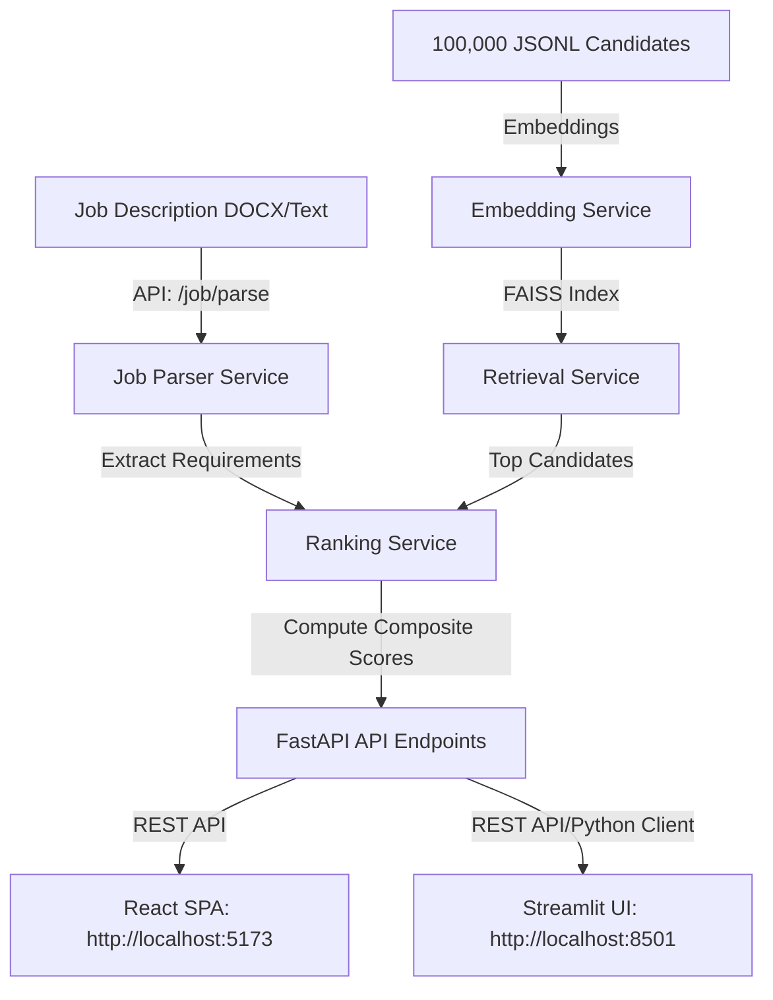

# AI Hiring Intelligence Platform

A production-grade candidate parsing, retrieval, and composite ranking platform designed to process large-scale candidate datasets against specific job requirements. This platform was developed for the Redrob Data & AI Challenge to rank 100,000 candidate profiles against a **Senior AI Engineer** job description.

Unlike the initial placeholder layout, the business logic, scoring formulas, vector search capability, and dual frontend dashboards are now fully implemented and verified.

---

## 🏗️ System Architecture

The project consists of three main components:
1. **Backend Service (FastAPI)**: Exposes endpoints for settings tuning, job requirements extraction/parsing, vector-based candidate retrieval (using FAISS), and composite ranking.
2. **Streamlit UI Service**: An interactive dashboard built in Python, tailored for quick inspection of candidate data, scoring distribution, and requirement analysis.
3. **React Single-Page Application (SPA)**: A premium, modern dashboard built with Vite, TypeScript, and Recharts, providing beautiful visual comparisons, real-time settings adjustment, AI matching insights, and candidate exploration.



---

## 🎯 Scoring & Composite Ranking Logic

Candidates are evaluated based on four primary criteria, which are weighted and combined into a final relevance score between `0.0` and `1.0`:

1. **Skill Fit Score (`35%` default weight)**: Evaluates semantic overlap and proficiency level between candidate's listed skills and the job's required skills.
2. **Experience Fit Score (`25%` default weight)**: Quantifies how closely the candidate's years of professional experience match the required tenure.
3. **Career Trajectory Score (`20%` default weight)**: Assesses match quality based on historical job titles, company size context, and industry compatibility.
4. **Behavioral Signal Score (`20%` default weight)**: Integrates platform engagement signals (notice period, response rates, GitHub activity, open-to-work flags, profile completeness).

*Note: All weights are fully configurable via settings endpoints/UIs.*

---

## 📁 Repository Directory Layout

```text
├── configs/                     # Application configurations
│   ├── local.yaml               # Settings for local runs
│   └── production.yaml          # Settings for production deployment
├── frontend/                    # Vite + React + TypeScript web app
│   ├── src/                     # React components, routing, Recharts dashboards
│   └── package.json             # JS/TS dependencies and scripts
├── src/
│   └── ai_hiring_intelligence/
│       ├── api/                 # FastAPI routes and server entry points
│       │   └── routes/          # API endpoints (health, hiring, metadata)
│       ├── core/                # Configuration schema and logging systems
│       ├── domain/              # Scoring rules, ranking models, candidate builder
│       ├── services/            # FAISS indexer, job parsing, ranking orchestration
│       └── ui/                  # Streamlit application pages
├── tests/                       # Complete pytest suite (16 tests)
│   ├── test_candidate_builder.py
│   ├── test_hiring_api.py
│   ├── test_job_parser.py
│   └── test_ranking_service.py
├── data_report.md               # Extensive exploratory data analysis (EDA) report
├── redrob_eda.ipynb             # Jupyter Notebook for raw data investigation
└── docker-compose.yml           # Compose file for local multi-service testing
```

---

## 🚀 Active API Endpoints

The backend exposes a rich REST API prefix under `/api` (`http://localhost:8000/api`):

| Endpoint | Method | Description |
|---|---|---|
| `/settings` | `GET` / `POST` | Retrieve and update the active scoring weights |
| `/job/parse` | `POST` | Extract requirements from raw text or job description docx |
| `/job/requirements` | `GET` | Fetch the current set of parsed requirements |
| `/candidates` | `GET` | Get paginated, searchable candidate profiles |
| `/candidates/{id}`| `GET` | Retrieve detail data for a single candidate profile |
| `/compare` | `GET` | Compare two candidate records side-by-side |
| `/rankings` | `GET` | Run the ranking engine to get sorted candidate scores |
| `/analytics` | `GET` | Retrieve aggregate metrics and distribution charts data |
| `/insights` | `GET` | Generate AI-driven highlights and warning flags per candidate |
| `/export` | `GET` | Download candidate ranking outputs as a CSV |
| `/v1/info` | `GET` | Metadata regarding app name, environment, and version |
| `/health` | `GET` | System health check (API dependency status) |

---

## 💻 Local Development Setup

### 1. Prerequisites
- Python 3.11
- Node.js (v18+)
- npm

### 2. Python Backend & Streamlit Setup
Create a virtual environment, install dependencies, and install the package in editable mode:
```bash
# Create and activate virtual environment
python -m venv .venv
.venv\Scripts\activate      # On Windows
source .venv/bin/activate    # On macOS/Linux

# Install requirements
pip install -r requirements.txt
pip install -e ".[dev]"
```

Configure your environment variables by copying `.env.example`:
```bash
cp .env.example .env
```

Start the FastAPI application:
```bash
uvicorn ai_hiring_intelligence.api.main:app --reload
```

Start the Streamlit interface:
```bash
streamlit run src/ai_hiring_intelligence/ui/app.py
```

### 3. React Frontend Setup
Navigate into the `frontend` directory, install packages, and boot up Vite:
```bash
cd frontend
npm install
npm run dev
```
Open `http://localhost:5173` to explore the rich React frontend dashboard.

### 4. Running Tests
Run the test suite using `pytest` to verify the computations:
```bash
pytest
```

---

## 🐳 Docker Deployment

To spin up the FastAPI service and the Streamlit app together in Docker:
```bash
docker compose up --build
```
- The backend API will be accessible at `http://localhost:8000`
- The Streamlit UI will be accessible at `http://localhost:8501`


